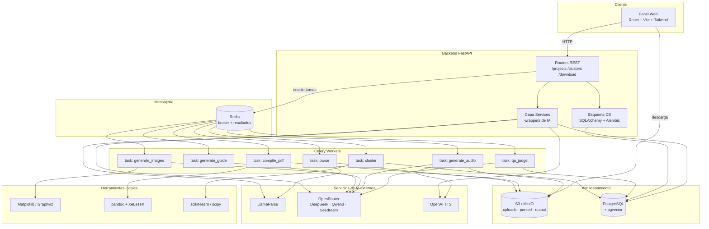

# Simplify — MVP en palabras sencillas

> Documento para entender **qué modelos de IA uso, para qué, y cómo se conectan**
> sin tecnicismos. Pensado para decidir si esta propuesta es la mejor opción
> antes de escribir una línea de código.

---

## 1. ¿Es esta la mejor opción? Mi opinión honesta

**Sí, para un MVP que cumpla la spec v1.0.** No porque sea la opción más
sofisticada, sino porque:

1. **Resuelve lo que la spec pide**, no lo que suena bien en una demo.
   La spec quiere *menos* documentos consolidados, una guía con 8 secciones
   fijas, imágenes coherentes, audio ≤5 min y un panel web. Esta propuesta
   entrega exactamente eso.
2. **Evita frameworks pesados** (LangChain) que para un pipeline lineal
   añaden complejidad sin aportar valor. La integración la hace tu propio
   backend con wrappers delgados.
3. **Es honesta con el costo y el tiempo**: ~$0.75–1.75 por proyecto y
   ~4–5 semanas de trabajo real, no los $2.28 / 96 h del plan anterior
   que ignoraban audio, frontend y clustering real.
4. **Deja fuera lo que la spec deja fuera** (modelo de negocio) y no
   inventa decisiones técnicas disfrazadas de negocio.

**Donde NO es la mejor opción:** si en el futuro quieres agentes autónomos
que decidan "re-parsear este doc" o "buscar info en internet", ahí sí haría
falta LangGraph o similar. Pero eso no está en la spec v1.0, así que no se
construye todavía.

---

## 2. Los modelos de IA que usaría (y para qué)

| Tarea | Modelo / Servicio | Por qué este | Costo aprox. por proyecto |
|-------|-------------------|--------------|---------------------------|
| **Parsear PDF → Markdown** | LlamaParse | Mejor calidad que alternativas gratuitas para PDFs mezclados (actas, presupuestos, cronogramas). Respeta tablas e imágenes. | $0 (free tier) o ~$0.30–0.50 si hay overage |
| **Explorar contenido** (Paso 1) | DeepSeek-V4-Flash (vía OpenRouter) | Barato y rápido para inferir "qué es este doc, de qué trata, qué tan relevante es". | ~$0.05 |
| **Embeddings** (para clustering) | Qwen3-Embedding (vía OpenRouter) | Buen desempeño en español, barato. Convierte texto en vectores para medir similitud. | ~$0.05 |
| **Clustering** | Ningún LLM — algoritmo clásico | `scikit-learn` (clustering aglomerativo) + `scipy` (dendrograma). No necesita IA, necesita matemática. | $0 |
| **Generar la guía ejecutiva** (Paso 3) | DeepSeek-V4-Flash | Suficiente para producir las 8 secciones fijas con un prompt estructurado. Más caro no mejora el resultado aquí. | ~$0.20 |
| **Script del audio narrado** (Paso 6) | DeepSeek-V4-Flash | Mismo modelo, prompt distinto: "reescribe la guía en lenguaje no técnico, ≤750 palabras". | ~$0.05 |
| **Imágenes estructuradas** (Paso 4, capa 1) | Matplotlib + Graphviz (local) | Para presupuestos (barras), cronogramas (Gantt), flujos de proceso (diagramas). Cero costo, control total del estilo. | $0 |
| **Imágenes conceptuales** (Paso 4, capa 2) | Seedream 5.0 Lite (vía OpenRouter) | Solo cuando no se puede generar localmente (diagramas arquitectónicos, conceptos abstractos). Tope duro de llamadas. | ~$0.20–0.50 |
| **Validador de coherencia visual** | DeepSeek-V4-Flash (como juez) | Recibe "qué imagen se esperaba" + "qué imagen se generó" y puntúa 1–5 si corresponden. Si <3, regenerar. | ~$0.05 |
| **Juez de criterios de la spec** (Sección 5) | DeepSeek-V4-Flash (como juez) | Evalúa claridad, completitud, concisión del audio antes de marcar la guía como lista. | ~$0.10 |
| **Audio narrado** (Paso 6) | OpenAI TTS `tts-1` (voz Alloy o similar) | Calidad decente en español, ~$15 por millón de caracteres → ~$0.10 por guía de 5 min. ElevenLabs como upgrade opcional. | ~$0.10–0.30 |

**Total por proyecto: ~$0.75–1.75** (frente a los $2.28 del plan anterior).
Baja porque produces 1–3 guías consolidadas, no 75 PDFs sueltos.

### Por qué casi todo va por OpenRouter

OpenRouter es un único punto de entrada a varios modelos (DeepSeek, Qwen3,
Seedream). Ventajas para un MVP:

- **Una sola API key**, un solo wrapper, una sola lógica de retry.
- **Facturación unificada**: ves el gasto en un panel, no en 5.
- **Fallback fácil**: si DeepSeek se cae, cambias una línea y usas otro modelo
  similar sin reescribir el código.

Los que NO van por OpenRouter: LlamaParse (tiene su propia API) y OpenAI TTS
(SDK oficial de OpenAI, más simple que ir por OpenRouter para audio).

---

## 3. Cosas que agregaría respecto a un pipeline "obvio"

Estas son las piezas que un plan ingenuo omite y que marcan la diferencia
entre "compila" y "cumple la spec":

### 3.1 Clustering real (no filtrado)
El plan anterior eliminaba duplicados y seguía tratando cada doc como unidad
independiente. La spec pide **agrupar** documentos afines en *menos*
consolidados. Sin esto, el resto del pipeline no tiene sentido.

- Algoritmo: clustering aglomerativo sobre embeddings, corte a umbral
  de similitud ~0.78 (afín pero no casi-duplicado).
- Umbral **configurable por proyecto**, no hardcodeado.
- Endpoint de auditoría: `GET /projects/{id}/clusters` muestra qué se
  agrupó con qué y por qué.

### 3.2 Limpieza previa separada del clustering
Documentos vacíos, de solo firmas o con <500 caracteres se excluyen en una
fase *anterior* al clustering, y se reportan aparte. Esto NO es "filtrar
duplicados" — es higiene. Mezclarlo con el clustering confunde la auditoría.

### 3.3 Guía con estructura fija forzada (no "headers genéricos")
La spec exige 8 secciones: hoja de presentación, índice, introducción,
conceptos básicos, procedimientos, imágenes, criterios de evaluación,
tiempos estimados. El prompt a DeepSeek debe **forzar** ese esquema con
un JSON schema de salida, no dejarlo a criterio del LLM. Si falta una
sección, se reintenta.

### 3.4 Validador de coherencia visual (criterio explícito de la spec)
La spec dice: "las imágenes generadas deben corresponder de manera precisa
a los procedimientos que ilustran". Un LLM juez verifica que la imagen
generada realmente ilustre lo que se esperaba. Si no, se regenera o se cae
a una imagen local genérica. Sin esto, "se ve profesional" no garantiza
"corresponde al procedimiento".

### 3.5 Control de duración del audio
La spec es tajante: **≤5 minutos**. A ~150 palabras/minuto son ≤750 palabras.
El script se valida por word-count antes de mandar a TTS. Si el audio real
supera 5 min, se regenera el script más conciso (máx. 2 intentos). Sin este
control, el criterio "concisión del resumen narrado" se cumple por suerte.

### 3.6 Juez de criterios de negocio (Sección 5 de la spec)
Además de coherencia visual, un LLM juez evalúa **claridad**, **completitud**
y **concisión del audio** antes de marcar la guía como `ready`. Si algún
criterio <3/5, se re-ejecuta la etapa correspondiente. Esto convierte los
criterios de la spec en *gates* reales, no en aspiraciones.

### 3.7 Panel web (no solo backend)
La spec exige que el usuario vea documento, imágenes y audio **en el panel,
sin descargar nada** (Paso 7). Un backend solo no cumple la spec. Mínimo:
React + visor PDF (PDF.js) + reproductor de audio HTML5 + galería de
imágenes + vista de clústeres.

### 3.8 Descargas granulares (4 modalidades, no 1)
La spec pide: ZIP completo, carpeta individual, audio individual, documento
individual. Cuatro endpoints, no uno genérico.

### 3.9 Cost ledger centralizado
Cada llamada a cualquier API loggea tokens/llamadas/costo en una tabla
`cost_ledger`. Reemplaza cualquier "observabilidad de LangChain" y te
permite reconciliar la factura real vs. el presupuesto.

### 3.10 Sin LangChain
Pipeline lineal + wrappers `httpx` propios + `tenacity` para retries +
`instructor` (opcional) para salida estructurada. Si en el futuro se
necesitan agentes autónomos, se añade LangGraph puntualmente, sin
refactorizar lo existente.

---

## 4. Cómo se estructuran los modelos en el pipeline

El flujo es **lineal y por clúster consolidado**, no por documento fuente.

```
80 PDFs sueltos
    │
    ▼
[Paso 1] Carga + exploración  ──── DeepSeek-V4-Flash infiere tema/relevancia
    │
    ▼
[Paso 1.5] Limpieza previa  ─────── descarta vacíos / firmas (<500 chars)
    │
    ▼
[Paso 2] Parseo  ─────────────────── LlamaParse → Markdown por doc
    │
    ▼
[Paso 2.5] Embeddings  ───────────── Qwen3-Embedding por sección
    │
    ▼
[Paso 2.6] Clustering  ───────────── scikit-learn (aglomerativo, umbral ~0.78)
    │                              └─ N clústeres (esperado 1–3)
    ▼
[Paso 2.7] Consolidación  ────────── merge de markdowns por clúster
    │                              └─ deduplicación de secciones casi-idénticas
    ▼
════════════════ A PARTIR DE AQUÍ: POR CLÚSTER ════════════════
    │
    ▼
[Paso 3] Guía ejecutiva  ─────────── DeepSeek-V4-Flash
    │                              └─ 8 secciones forzadas (JSON schema)
    │                              └─ marca image_opportunities[]
    ▼
[Paso 4] Imágenes  ────────────────── capa 1: Matplotlib/Graphviz (local)
    │                              └─ capa 2: Seedream (solo si local no aplica)
    │                              └─ validador de coherencia visual (DeepSeek juez)
    ▼
[Paso 5] Compilación  ────────────── pandoc + XeLaTeX → guide.pdf
    │
    ▼
[Paso 6] Audio narrado  ──────────── DeepSeek-V4-Flash (script ≤750 palabras)
    │                              └─ OpenAI TTS → narration.mp3
    │                              └─ validación de duración ≤5 min
    ▼
[Paso 6.5] QA de negocio  ─────────── LLM juez: claridad, completitud,
    │                              coherencia visual, concisión del audio
    │                              └─ si algún criterio <3/5 → re-ejecutar etapa
    ▼
[Paso 7] Entrega en panel  ────────── React: PDF.js + audio + galería
    │
    ▼
[Paso 8] Descargas  ──────────────── ZIP / carpeta / audio / documento
```

**Punto clave:** todo lo que está **después del clustering** corre *una vez
por clúster*, no una vez por documento fuente. Por eso el costo y el tiempo
bajan respecto al plan anterior.

---

## 5. Arquitectura final del MVP



### Componentes en palabras

- **Panel Web (React):** lo que ve el usuario. Sube PDFs, ve el estado del
  pipeline por etapa, visualiza PDFs/imágenes/audio sin descargar, y
  descarga en 4 modalidades.
- **FastAPI:** orquestador. Recibe uploads, expone endpoints, encola tareas
  en Celery, sirve URLs firmadas de S3.
- **Celery + Redis:** los trabajos largos (parsear 80 PDFs, generar imágenes,
  compilar) corren en background para no bloquear la API.
- **PostgreSQL + pgvector:** guarda proyectos, documentos, clústeres,
  guías, imágenes, audio, costos y los embeddings para clustering.
- **S3/MinIO:** almacena archivos (uploads, markdown parseado, PDFs finales,
  imágenes, audio).
- **OpenRouter:** puerta única a DeepSeek, Qwen3 y Seedream.
- **LlamaParse y OpenAI TTS:** APIs directas (no por OpenRouter).
- **Matplotlib/Graphviz, pandoc/XeLaTeX, scikit-learn:** herramientas
  locales sin costo de API.

---

## 6. Stack resumido en una tabla

| Capa | Tecnología | Rol |
|------|-----------|-----|
| Frontend | React + Vite + Tailwind + PDF.js | Panel web (Paso 7 y 8) |
| API | FastAPI + Uvicorn | Orquestación y endpoints |
| Auth | JWT (PyJWT) | Sesión básica |
| Cola | Celery + Redis | Tareas asíncronas |
| DB | PostgreSQL + pgvector + Alembic | Datos + embeddings |
| Storage | S3 / MinIO | Archivos binarios |
| LLM texto | OpenRouter (DeepSeek-V4-Flash, Qwen3) | Exploración, guía, script, jueces |
| Embeddings | Qwen3-Embedding (OpenRouter) | Similitud para clustering |
| Imágenes IA | Seedream 5.0 Lite (OpenRouter) | Diagramas conceptuales |
| Imágenes locales | Matplotlib + Graphviz | Gráficos estructurados |
| PDF parse | LlamaParse | PDF → Markdown |
| PDF compile | pandoc + XeLaTeX | Markdown → PDF |
| TTS | OpenAI `tts-1` | Audio narrado |
| Clustering | scikit-learn + scipy | Agrupación aglomerativa |
| Salida estructurada | `instructor` (opcional) | Forzar JSON schema en LLM |
| Retries | `tenacity` | Backoff exponencial |
| HTTP | `httpx` | Cliente async hacia APIs |

**No hay LangChain.** Si aparece un caso de uso que lo justifique (agentes
autónomos en post-MVP), se añade LangGraph puntualmente.

---

## 7. Lo que deliberadamente NO está en el MVP

- **Modelo de negocio / monetización** — la spec lo excluye explícitamente
  (secciones 1.2 y 7). Cualquier límite de uso gratuito debe venir como
  decisión de negocio consciente, no como default técnico.
- **Agentes autónomos** — el pipeline es lineal y determinista. Si se
  necesitan, se añaden después con LangGraph.
- **RAG sobre base de conocimiento externa** — la spec no lo pide; los
  documentos fuente del proyecto son toda la información necesaria.
- **Multi-tenant / SaaS completo** — el MVP es un proyecto a la vez. La
  multi-cuenta se añade cuando el modelo de negocio esté definido.

---

## 8. Decisión que te toca antes de empezar

1. **¿1–3 guías por proyecto, o 75 PDFs sueltos?** La spec apoya lo primero
   (consolidación), pero conviene confirmar con quien defina el modelo de
   negocio, porque cambia la economía unitaria.
2. **¿4 semanas tight o 5 semanas con frontend pulido?** Recomiendo 5.
3. **¿Spike de clustering primero?** Medio día con 10–20 PDFs reales calibra
   el umbral antes de construir el resto encima.
